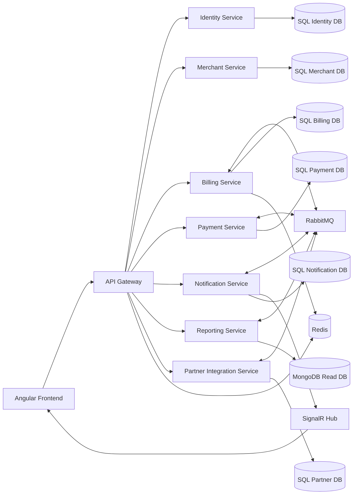
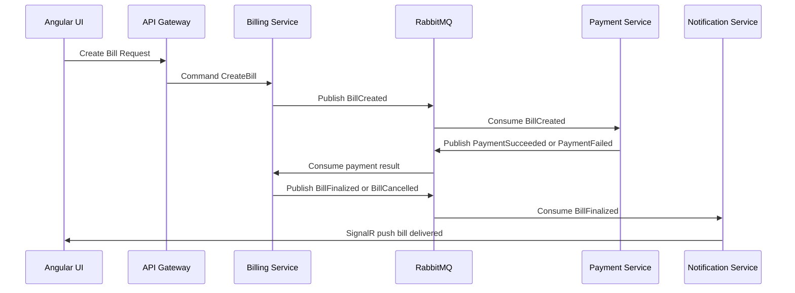

# Green Bill Microservices Architecture Blueprint

## 1. Vision and Problem Statement

Green Bill is a local first digital billing platform where customers receive bills for petrol, parking, and other merchant transactions without needing physical paper bills.

Primary goals:

- Digital bill generation and retrieval
- Multi role platform with strict role based access
- Local development and deployment only, no cloud dependency
- Hands on implementation of modern architecture patterns

Supported roles:

- Owner
- Merchant
- Customer
- Partner

## 2. Architecture Principles

- Domain driven boundaries per service
- Database per service (no shared write model)
- Async event driven communication for decoupling
- Sync HTTP/gRPC only when immediate response is needed
- CQRS for complex business flows and read optimization
- Saga for distributed transaction orchestration
- Observability first: logs, metrics, traces
- Security by default: JWT, refresh tokens, RBAC, idempotency

## 3. Recommended Local and Free Technology Stack

Backend:

- .NET 9 Web API
- MediatR for CQRS command/query handlers
- FluentValidation for input validation
- EF Core with SQL Server for transactional services
- Dapper for high performance read models where useful

Frontend:

- Angular (latest stable)
- NgRx (optional but recommended for complex state)
- Angular SignalR client for live bill updates

Message broker:

- RabbitMQ (free, runs locally via Docker)

Caching and realtime state:

- Redis (free, local Docker)

NoSQL (free options):

- MongoDB Community Edition (free)
- PostgreSQL JSONB alternative (if you want one database engine)
- Elasticsearch/OpenSearch (optional for search heavy scenarios)

Observability local:

- Seq for structured logs (free tier is enough locally)
- Prometheus + Grafana for metrics
- Jaeger for distributed tracing

Local orchestration:

- Docker Compose for all infrastructure and services

## 4. High Level Service Landscape

Core services:

1. Identity Service
2. Merchant Service
3. Billing Service
4. Payment Service
5. Notification Service
6. Partner Integration Service
7. Reporting Service
8. API Gateway

Supporting components:

- Redis cache
- RabbitMQ broker
- SQL Server instances or databases per service
- MongoDB for bill timeline/search projections (optional but recommended)
- SignalR Hub service (can be in Notification or dedicated Realtime service)

## 5. Service Responsibilities

### 5.1 Identity Service

Responsibilities:

- User registration/login
- JWT access token and refresh token lifecycle
- Role assignment and claims issuance
- Password hashing, security audit trails

Own database:

- SQL Server: users, roles, user_roles, refresh_tokens, auth_audit

Key endpoints:

- POST /api/auth/register
- POST /api/auth/login
- POST /api/auth/refresh
- POST /api/auth/revoke

### 5.2 Merchant Service

Responsibilities:

- Merchant onboarding
- Outlet/station/parking location management
- Product/service catalog and tax rules

Own database:

- SQL Server: merchants, outlets, services, pricing_rules, tax_profiles

### 5.3 Billing Service

Responsibilities:

- Create bill draft
- Finalize bill after payment confirmation
- Bill line items, taxes, discounts
- Bill status transitions

Own database:

- SQL Server write model
- Optional MongoDB read model for timeline and fast retrieval

### 5.4 Payment Service

Responsibilities:

- Payment intent creation
- Payment status tracking
- Reconciliation and failure retries

Own database:

- SQL Server: payment_intents, payment_transactions, reconciliation_log

### 5.5 Notification Service

Responsibilities:

- Push notifications
- Email/SMS simulation locally
- SignalR real time bill delivery

Own database:

- SQL Server or MongoDB: notification_queue, notification_history

### 5.6 Partner Integration Service

Responsibilities:

- Partner APIs/webhooks
- Partner specific mapping/rate limiting
- Access control for Partner role

Own database:

- SQL Server: partner_accounts, webhook_subscriptions, api_keys

### 5.7 Reporting Service

Responsibilities:

- Analytics dashboards (owner and merchant views)
- Aggregated revenue, usage, customer trends
- Read only projections from events

Own database:

- NoSQL recommended (MongoDB) for precomputed aggregates

### 5.8 API Gateway

Responsibilities:

- Single entry point for Angular app
- JWT validation and routing
- Correlation ID propagation
- Basic rate limiting and IP rules

Recommended:

- YARP in .NET

## 6. Communication Model

Synchronous communication:

- API Gateway to backend services (HTTP)
- Rare internal service to service call for immediate query only

Asynchronous communication:

- RabbitMQ events for cross service workflows
- Outbox pattern to ensure reliable event publication

Realtime communication:

- SignalR for customer and merchant dashboards

### Event examples

- BillCreated
- PaymentRequested
- PaymentSucceeded
- PaymentFailed
- BillFinalized
- BillDelivered
- PartnerCallbackRequested

## 7. Mermaid Architecture Diagrams

### 7.1 System Context



### 7.2 Billing Saga (Orchestration)



## 8. Role Based Access Matrix

Owner:

- Full platform administration
- View all merchants, reports, financial summaries
- Manage role policies

Merchant:

- Manage outlets and issue bills
- View merchant scoped transactions and reports

Customer:

- View own bills
- Download/share bills
- Manage profile and notification preferences

Partner:

- Access partner APIs/webhooks
- Submit/receive partner specific billing data

Authorization strategy:

- JWT contains roles and scoped claims
- Policy based authorization in each service
- Resource ownership checks in business layer

## 9. Databases and Storage Strategy

SQL Server usage:

- Identity, Merchant, Billing, Payment core transactional workloads

NoSQL usage (free and useful):

- MongoDB for read models and timeline projections
- Keep SQL as source of truth

Recommended approach:

1. Start with SQL per service for correctness
2. Add MongoDB read projection in Reporting and Customer Bill History
3. Populate MongoDB asynchronously from RabbitMQ events

## 10. CQRS Design in Services

Command side:

- Handles writes and domain invariants
- Uses MediatR command handlers
- Emits domain events to outbox

Query side:

- Optimized read endpoints
- Uses Dapper or Mongo queries
- Can denormalize and precompute data

Example in Billing:

- Commands: CreateBill, AddLineItem, FinalizeBill, CancelBill
- Queries: GetBillById, GetBillsByCustomer, GetMerchantDailySummary

## 11. Saga Pattern Recommendation

Use Saga for bill to payment to notification workflow.

Option A: Orchestration Saga (recommended for learning)

- Dedicated Saga coordinator in Billing service
- Explicit state machine in SQL table billing_saga_state

Option B: Choreography Saga

- Services react to events without central coordinator
- Simpler setup, harder debugging

Learning path:

- Start with orchestration
- Move one flow to choreography to compare tradeoffs

## 12. Redis Cache Strategy

Use Redis for:

- Frequently read bill summaries
- Merchant profile cache
- Idempotency key storage
- Sliding window rate limit counters

Cache policies:

- Short TTL for volatile objects
- Event driven invalidation after write operations
- Key naming convention: service:entity:id

## 13. SignalR Realtime Design

Use SignalR to push:

- New bill generated for customer
- Payment status updates
- Merchant dashboard live counters

Hub grouping strategy:

- User group by UserId
- Merchant group by MerchantId

Security:

- JWT bearer auth for hub
- Verify claim to group mapping server side

## 14. Message Broker Design (RabbitMQ)

Exchange model:

- Topic exchange for domain events

Routing key examples:

- billing.bill.created
- payment.intent.succeeded
- payment.intent.failed
- billing.bill.finalized
- notification.bill.dispatch.requested

Queue strategy:

- One queue per service consumer group
- Dead letter queue per business queue
- Retry with exponential backoff policy

Reliability patterns:

- Outbox pattern in producer
- Inbox deduplication in consumer
- Idempotent handlers

## 15. Security Architecture

Identity tokens:

- Access token (JWT): 15 minutes
- Refresh token: 7 days, hashed in DB, rotate on use

API security:

- HTTPS locally (dev cert)
- Role and policy authorization attributes
- Input validation and model sanitization
- Correlation ID per request

Additional controls:

- Audit logging for auth and critical financial actions
- Brute force mitigation for login endpoint
- Optional per endpoint rate limit

## 16. Middleware and Filters (Must Have)

Custom middleware:

1. CorrelationIdMiddleware
2. ExceptionHandlingMiddleware
3. RequestResponseLoggingMiddleware
4. IdempotencyMiddleware for payment and bill creation
5. Tenant or merchant scope middleware (if multi tenant later)

ASP.NET filters:

- Validation action filter (if not fully MediatR based)
- Permission filter for dynamic claim checks
- ETag/cache filter for read endpoints

## 17. API Contract and Versioning

- Version APIs from day one: /api/v1
- Keep backward compatibility for frontend integration
- Use consistent problem details response format
- Generate OpenAPI per service

## 18. Recommended Monorepo Folder Structure

```text
green-bill/
	services/
		identity-service/
		merchant-service/
		billing-service/
		payment-service/
		notification-service/
		reporting-service/
		partner-service/
		gateway-service/
	frontend/
		green-bill-angular/
	building-blocks/
		contracts/
		shared-kernel/
		observability/
	infra/
		docker/
			docker-compose.yml
			rabbitmq/
			redis/
			sqlserver/
			mongodb/
			seq/
			grafana/
			prometheus/
```

## 19. Local Infrastructure with Docker Compose

Run locally:

- SQL Server container
- RabbitMQ with management UI
- Redis
- MongoDB
- Seq
- Prometheus
- Grafana
- Jaeger

Ports suggestion:

- SQL Server 1433
- RabbitMQ 5672, UI 15672
- Redis 6379
- MongoDB 27017
- Seq 5341/80xx
- Grafana 3000
- Prometheus 9090
- Jaeger 16686

## 20. End to End Workflow Example

Purchase flow:

1. Merchant app sends CreateBill command
2. Billing creates bill as PendingPayment and emits BillCreated
3. Payment consumes event and processes payment
4. Payment emits PaymentSucceeded
5. Billing finalizes bill and emits BillFinalized
6. Notification consumes BillFinalized and sends SignalR push
7. Customer app receives live bill and can download PDF

Failure flow:

1. Payment emits PaymentFailed
2. Billing marks bill Failed
3. Notification emits failure message
4. Saga records compensation complete

## 21. Data Contracts and Integration Contracts

Use strongly typed event contracts package:

- BillCreatedEvent
- PaymentSucceededEvent
- PaymentFailedEvent
- BillFinalizedEvent

Contract versioning:

- Include event version in payload metadata
- Never break existing consumers without transition period

## 22. Testing Strategy

Unit tests:

- Command handlers
- Domain rules
- Middleware behavior

Integration tests:

- API + SQL container
- Consumer tests with RabbitMQ test container

Contract tests:

- Event schema compatibility checks

End to end tests:

- Full flow from Angular UI to bill delivery

Performance tests:

- Load billing APIs
- Measure queue lag, cache hit ratio, p95 latencies

## 23. Observability and Diagnostics

Logging:

- Serilog with structured logging
- CorrelationId, UserId, MerchantId in log scope

Metrics:

- Request count, latency, error rate
- Queue depth, consumer lag
- Saga success/failure rates

Tracing:

- OpenTelemetry instrumentation
- Cross service trace propagation via headers and message metadata

## 24. CI and CD for Local First Setup

No cloud needed. Use local automation.

Pipeline stages:

1. Restore
2. Build
3. Unit tests
4. Integration tests (containers)
5. Lint and static analysis
6. Package docker images

Tools:

- GitHub Actions local runner or Jenkins local
- Or simple script based pipeline for learning

## 25. Step by Step Execution Plan

### Phase 1: Foundation

1. Finalize identity service with roles and JWT refresh flow
2. Add API Gateway
3. Add shared contracts project
4. Add custom middleware baseline

### Phase 2: Merchant and Billing Core

1. Build Merchant service
2. Build Billing write model
3. Add CQRS query endpoints
4. Add SQL databases per service

### Phase 3: Async and Saga

1. Add RabbitMQ publisher and consumers
2. Implement outbox pattern
3. Implement Billing orchestration saga
4. Add DLQ and retry policies

### Phase 4: Payment and Notification

1. Build Payment service with idempotent operations
2. Build Notification service
3. Add SignalR live updates
4. Add customer notification history query

### Phase 5: Read Models and Performance

1. Add MongoDB projections for reporting and bill timeline
2. Add Redis cache and invalidation
3. Add Dapper optimized queries
4. Tune indexes and query plans

### Phase 6: Observability and Hardening

1. Add Serilog + Seq
2. Add OpenTelemetry + Jaeger
3. Add Prometheus + Grafana dashboards
4. Add security hardening and rate limits

## 26. Suggested Initial Database Design

Identity SQL:

- Users
- Roles
- UserRoles
- RefreshTokens
- AuthAudit

Billing SQL:

- Bills
- BillLineItems
- BillTaxes
- BillStatusHistory
- OutboxMessages
- SagaState

Payment SQL:

- PaymentIntents
- PaymentTransactions
- PaymentStatusHistory
- InboxProcessedMessages

Mongo read model:

- CustomerBillTimeline
- MerchantDashboardCards
- DailyAggregates

## 27. Free NoSQL Options Decision

Best free choice for your local setup:

- MongoDB Community Edition

Why:

- Free and easy Docker image
- Good for event sourced read projections
- Flexible schema for evolving bill payloads

Alternative:

- PostgreSQL JSONB if you prefer fewer engines

## 28. Angular Frontend Architecture

Suggested frontend modules:

- auth-module
- owner-module
- merchant-module
- customer-module
- partner-module
- shared-ui-module

Frontend patterns:

- Route guards by role
- Interceptor for JWT and correlation ID
- SignalR service singleton
- State management with NgRx for bill/payment flows

## 29. Non Functional Requirements Checklist

- Availability target for local demo: 99 percent while services running
- p95 API response under 300 ms for read APIs
- At least once event delivery with idempotent consumers
- Full audit trail for financial actions
- No plaintext refresh tokens in database

## 30. Risks and Mitigation

Risk: eventual consistency confusion

- Mitigation: clear status model and UI hints

Risk: duplicate message processing

- Mitigation: inbox table and idempotency keys

Risk: over engineering too early

- Mitigation: phase wise rollout and keep MVP small first

## 31. MVP Cut for First Working Demo

Must include:

1. Identity with all 4 roles
2. Merchant creates bill
3. Payment mock success
4. Customer receives bill via SignalR
5. Bill history page
6. RabbitMQ based async communication
7. Redis cache for bill lookup

Then expand to full architecture.

## 32. Implementation Notes for Your Existing Identity Project

- Keep current CQRS structure and expand feature folders
- Add role seeding and strict role validation
- Keep refresh token rotation already implemented
- Add policy based authorization and claims tests
- Add audit log table and middleware for request correlation

## 33. Final Recommendation

For best hands on learning with real world patterns on free local setup:

1. Use SQL Server for transactional microservices
2. Add MongoDB for read projections and reporting
3. Use RabbitMQ for event bus
4. Use Redis for cache/idempotency/rate limiting
5. Use SignalR for realtime bill delivery
6. Implement CQRS in each service where complexity justifies it
7. Implement Saga in Billing payment flow
8. Add observability stack from day one

This gives you practical experience with microservices, distributed consistency, real time communication, caching, messaging, and modern API architecture without any cloud cost.
